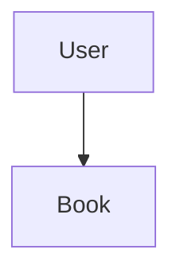

# Library Management System

[](https://www.oracle.com/java/)
[](https://spring.io/projects/spring-boot)
[](https://www.mysql.com/)
[](https://redis.io/)
[](LICENSE)

A backend application for managing library operations, built with **Spring Boot 3.4.2**, **Java 23**, **Spring Security**, **Spring Data JPA (MySQL)**, and **Redis Cache**. The system supports role-based user management (Admin & Student), book inventory tracking, author mapping, and transactional book issuance/returns with fine calculation.

---

## Table of Contents
- [Architecture & Overview](#architecture--overview)
- [Key Features](#key-features)
- [Tech Stack & Prerequisites](#tech-stack--prerequisites)
- [Entity-Relationship Diagram](#entity-relationship-diagram)
- [Configuration & Environment Setup](#configuration--environment-setup)
- [API Documentation](#api-documentation)
  - [User Endpoints](#user-endpoints)
  - [Book Endpoints](#book-endpoints)
  - [Transaction Endpoints](#transaction-endpoints)
  - [Author Endpoints](#author-endpoints)
- [Fine Calculation Business Logic](#fine-calculation-business-logic)
- [Security & Access Control](#security--access-control)
- [Caching Strategy](#caching-strategy)
- [Building & Running the Application](#building--running-the-application)
- [Testing](#testing)

---

## Architecture & Overview

The application follows a standard layered Spring Boot architecture:
1. **Controller Layer (`org.jbd.JBD_MINOR1.Controller`)**: REST API endpoints exposed for clients (Postman/Frontend).
2. **Service Layer (`org.jbd.JBD_MINOR1.Service`)**: Implements core business logic, validation rules, transactional state transitions, fine logic, and Redis caching integration.
3. **Repository Layer (`org.jbd.JBD_MINOR1.Repository`)**: JPA Repositories for MySQL interaction, custom native SQL queries, and Redis operations via `RedisTemplate`.
4. **Model Layer (`org.jbd.JBD_MINOR1.Model`)**: JPA entities defining tables, schemas, relationships, enums, and Spring Security `UserDetails` implementation.
5. **Configuration Layer (`org.jbd.JBD_MINOR1.minor1Configurations`)**: Security rules, Redis lettuce connection factory, and encoder beans.

---

## Key Features

- **Role-Based Access Control (RBAC)**: Secure access using Spring Security for `ADMIN` and `STUDENT` roles with password encryption (`BCryptPasswordEncoder`).
- **Cache-Aside Pattern with Redis**: Caches user details to reduce repeated database lookups during authentication.
- **Dynamic Criteria Querying**: Flexible multi-parameter search capabilities for users and books supporting custom SQL operators (`=`, `<`, `>`, `LIKE`, `IN`).
- **Transactional Book Operations**: `@Transactional(rollbackOn = TxnException.class)` ensures atomicity during book issuing and returns.
- **Automated Fine Settlement**: Automatic calculation of overdue fines based on configured retention limits and daily fine rates.
- **Global Exception Handling**: Centralized exception advice handling invalid parameters, transactional failures, and missing resource errors seamlessly.

---

## Tech Stack & Prerequisites

### Frameworks & Libraries
- **Java**: JDK 23
- **Spring Boot**: 3.4.2
- **Persistence**: Spring Data JPA, Hibernate, MySQL 8 Dialect
- **Caching**: Spring Data Redis (Lettuce Client)
- **Security**: Spring Security 6 (HTTP Basic & Form Login)
- **Utilities**: Lombok, Jackson JSON
- **Testing**: JUnit 4, Mockito, MockMvc

### Prerequisites
- JDK 23 installed
- MySQL Server running on `localhost:3306`
- Redis Server running locally or remotely

---

## Entity-Relationship Diagram



---

## Configuration & Environment Setup

Configure database and Redis parameters in `src/main/resources/application.properties`:

```properties
spring.application.name=JBD-MINOR1
server.port=8081

# Database Configuration
spring.datasource.url=jdbc:mysql://localhost:3306/JBD-MINOR1?createDatabaseIfNotExist=true
spring.datasource.username=root
spring.datasource.password=your_password
spring.jpa.hibernate.ddl-auto=update
spring.jpa.show-sql=true
spring.jpa.properties.hibernate.dialect=org.hibernate.dialect.MySQL8Dialect

# Business Rules
book.valid.upto=14
book.fine.amount.per.day=1

# Authority Roles
student.authority=STUDENT
admin.authority=ADMIN

# Redis Cache Settings
redis.host=host_address
redis.port=port_no
redis.password=host_password
redis.user.details.timeout=600000
```

---

## API Documentation

### User Endpoints

| Method | Endpoint | Access Level | Description |
| :--- | :--- | :--- | :--- |
| `POST` | `/user/addStudent` | Public | Register a new Student account |
| `POST` | `/user/addAdmin` | Public | Register a new Admin account |
| `GET` | `/user/filter` | `ADMIN`, `STUDENT` | Filter users dynamically |

#### Request Example: Register Student (`POST /user/addStudent`)
```json
{
  "userName": "John Doe",
  "phoneNo": "9998887770",
  "email": "john.doe@example.com",
  "password": "securepassword123",
  "address": "123 Campus Street"
}
```

#### Request Example: User Filter (`GET /user/filter?filterBy=PHONE_NUMBER&operator=EQUALS&values=9998887770`)

---

### Book Endpoints

| Method | Endpoint | Access Level | Description |
| :--- | :--- | :--- | :--- |
| `POST` | `/book/addBook` | `ADMIN` | Add a new book & auto-map author |
| `GET` | `/book/filter` | `ADMIN`, `STUDENT` | Search & filter books |

#### Request Example: Add Book (`POST /book/addBook`)
```json
{
  "booktitle": "Java Spring Boot in Action",
  "bookNo": "BK-1001",
  "authorName": "Craig Walls",
  "authorEmail": "craig@example.com",
  "type": "EDUCATIONAL",
  "securityAmount": 500
}
```

#### Request Example: Filter Books (`GET /book/filter?filterBy=BOOK_TYPE&operator=EQUALS&value=EDUCATIONAL`)
Allowed `filterBy` values: `AUTHOR_NAME`, `SECURITY_AMOUNT`, `BOOK_TITLE`, `BOOK_TYPE`, `BOOK_NO`  
Allowed `operator` values: `EQUALS`, `LESS_THAN`, `GREATER_THAN`, `LIKE`, `IN`

---

### Transaction Endpoints

| Method | Endpoint | Access Level | Description |
| :--- | :--- | :--- | :--- |
| `POST` | `/txn/create` | `ADMIN` | Issue a book to a student |
| `PUT` | `/txn/return` | `ADMIN` | Process book return & calculate fine |

#### Request Example: Issue Book (`POST /txn/create`)
```json
{
  "userPhoneNo": "9998887770",
  "bookNo": "BK-1001"
}
```
*Response*: `"8a5c3e41-0f72-4b2a-89a1-5d4c82b01234"` (Unique UUID string)

#### Request Example: Return Book (`PUT /txn/return`)
```json
{
  "userPhoneNo": "9998887770",
  "bookNo": "BK-1001"
}
```
*Response*: `500` (Settlement amount refunded after fine deduction)

---

### Author Endpoints

| Method | Endpoint | Access Level | Description |
| :--- | :--- | :--- | :--- |
| `GET` | `/author/getAuthorData` | Authenticated | Retrieve author details by email |

---

## Fine Calculation Business Logic

When a student returns a book via `/txn/return`:
1. The transaction duration is calculated: $\Delta t = t_{\text{return}} - t_{\text{issue}}$.
2. Overdue days are evaluated:
$$\text{Days Passed} = \left\lfloor \frac{\Delta t}{24 \times 60 \times 60 \times 1000} \right\rfloor$$
3. If $\text{Days Passed} > \text{validDays}$:
$$\text{Fine Amount} = (\text{Days Passed} - \text{validDays}) \times \text{finePerDay}$$
$$\text{Settlement Amount} = \text{securityAmount} - \text{Fine Amount}$$
4. If returned within the allowed window ($\le 14$ days), the status is set to `RETURNED` with full refund of the security deposit. If fine is incurred, transaction status becomes `FINED`.

---

## Security & Access Control

Spring Security enforces authentication via HttpBasic / FormLogin:
- Public registration endpoints: `/user/addStudent/**`, `/user/addAdmin/**`
- Admin-only management endpoints: `/txn/create/**`, `/txn/return/**`, `/book/addBook/**`
- Shared student/admin access: `/user/filter/**`, `/book/filter/**`
- Password storage is securely hashed using standard BCrypt algorithm.

---

## Caching Strategy

User authentication lookup implements a Cache-Aside pattern:
1. `loadUserByUsername(email)` queries `UserCacheRepository` (Redis key pattern: `user::<email>`).
2. Cache Hit: Returns cached `User` object directly.
3. Cache Miss: Queries MySQL database, populates Redis cache with a configurable TTL (`redis.user.details.timeout`), and returns user object.

---

## Building & Running the Application

### 1. Build project with Maven wrapper
```bash
./mvnw clean package
```

### 2. Run the Spring Boot application
```bash
./mvnw spring-boot:run
```
The application will start on port `8081` at `http://localhost:8081`.

---

## Testing

Run unit & integration tests using Maven:
```bash
./mvnw test
```

### Key Test Suites Included:
- **`TestTxnService`**: Verifies transactional logic, fine calculation formulas, student lookup mocks, and return handling.
- **`TestBookController`**: Controller-layer MockMvc tests validating HTTP request payloads and endpoint status codes.
